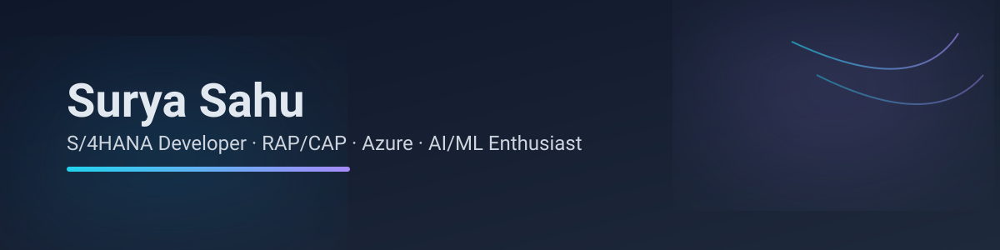

<!-- Profile README for surya-null -->
<!-- Keep it crisp, scannable, achievement-focused -->

  

  https://komarev.com/ghpvc/?username=surya-null&style=for-the-badge&color=0e75b6
  https://github.com/surya-null?tab=followers
  <a href="#">https://img.shields.io/badge/Open%20to%20Work-Yes-2ea44f?style=for-the-badge</a>

---

### 👋 Hi, I'm Surya
**S/4HANA Developer (ABAP/RAP/CAP) | Building reliable enterprise systems & practical AI copilots**  
Focused on clean architecture, performance, and developer experience. Exploring **AI/ML** to add intelligence to SAP workflows & Fiori apps.

- 🧠 Interests: **Enterprise extensibility, RAP/CAP, clean ABAP, Azure/OpenAI integration, LLM tooling**
- 🏔️ Fun: **Trekking**. Teams that ship and care about code quality.
- 📍 Bangalore, India · 💬 English/Hindi

---

## 🔥 Signature Projects (hand-picked)
> Recruiters: short pitch first, code & results linked.

- **Real-time Event Processing for S/4HANA**
  - *Python, Kafka, Spark, ABAP RFC* — Processed IDocs/BAPIs to downstream lakehouse with <50ms avg latency, exactly-once semantics, idempotent recon.
  - **Repo** · **Results:** throughput +x, failed retries ↓, recon time ↓

- **RAP-based Business Object & Fiori Elements App**
  - *ABAP RAP, CDS, Annotations, OData V4* — Clean domain model, behavior impl, draft handling, test seams; shipped with performance tracing and ABAP Unit.
  - **Repo** · **Demo:** 🎥

- **SAP Fiori Copilot (Azure OpenAI)**
  - *CAP (Node/Java), GenAI, JWT, Destinations* — Context-aware Q&A, workflow suggestions from SAP data with guardrails and prompt safety.
  - **Repo** · **Architecture:** Doc

> _Tip: Replace `#` with your live repos/videos/docs. If private, add sanitized case studies._

---

## 🧰 Tech Stack & Tools

**Languages:**  
!ABAP
!Python
!TypeScript
!SQL

**SAP/BTP:**  
!S/4HANA
!RAP
!CAP
!Fiori

**Platforms:**  
!Azure
!AWS
!Docker
!Kubernetes

**Data/AI:**  
!Pandas
!Spark
!Kafka
!Azure OpenAI

---

## 📊 Developer Footprint

<!-- Auto-updated metrics (via .github/workflows/metrics.yml) -->

  

<!-- GitHub Readme Stats / Streak / Top Languages -->

  https://github-readme-stats.vercel.app/api?username=surya-null&show_icons=true&theme=tokyonight&hide_border=true
  https://streak-stats.demolab.com?user=surya-null&theme=tokyonight&hide_border=true
  https://github-readme-stats.vercel.app/api/top-langs/?username=surya-null&layout=compact&theme=tokyonight&hide_border=true

> ⚠️ These images are generated by popular open-source services. If they ever rate-limit or go down, the page still looks great (banner + metrics.svg + curated sections).

---

## 🧪 Open Source & Contributions
- Meaningful reviews, small improvements, docs and examples.
- Interested in issues around **performance**, **DX**, **testability**, and **clean abstractions**.

  
Recent Activity

- PRs/Issues/Reviews feed can be automated; ping me if you want it added.
  

---

## 🎤 Talks & Certifications
- Clean ABAP & RAP Patterns (internal lunch & learn) — *Slides repo coming soon*  
- SAP Extension Suite (CAP) foundations — *learning path*  
- Azure AI Studio basics — *hands-on prototypes*

---

## 📬 Contact
- ✉️ Email: `your.email@domain.com` *(replace with your contact; obfuscated format recommended)*
- 🔗 LinkedIn: linkedin.com/in/YOUR-HANDLE
- 🗓️ Calendly: calendly.com/YOUR-HANDLE *(optional)*

---

### ⚙️ How this README is maintained
- **`metrics.svg`** is refreshed daily by a GitHub Action.
- **Links** are checked on PRs to avoid broken references.
- Profile content uses **scannable bullets**, **outcome-first project blurbs**, and **live stats** recruiters expect.

---

> 💡 **Quick tips for recruiters:** I love trekking and building well-crafted systems. If you need someone to ship reliable enterprise-grade features with a pragmatic AI angle—let’s talk.

